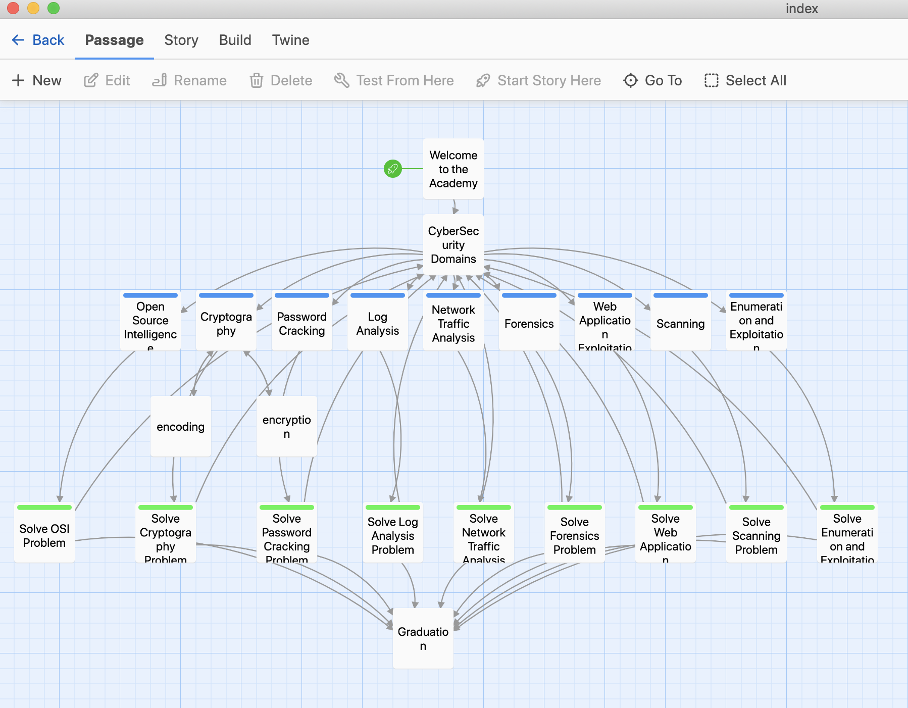
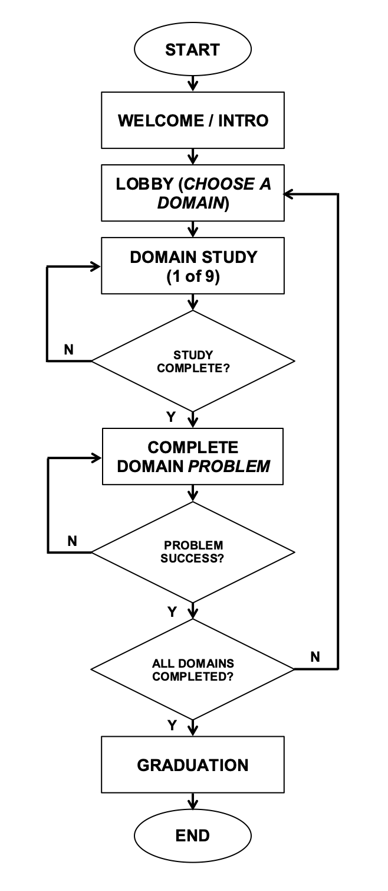

# threatcadet 
*This is a Twine-generated proof-of-concept for a game-based learning project.*

Published site: [https://bonnieho.github.io/threatcadet/](https://bonnieho.github.io/threatcadet)

## Overview

This was an exercise to become familiar with storyboarding a basic game using the Twine application. 'Passages' were created representing individual pages (much like slides in PowerPoint), and each of those pages were linked together using hyperlinks. Conditional statements were built in so the game was less linear.

The following diagram illustrates the layout and relationships between passages as developed in Twine:

- - - 

### How it works

The premise is that the player/student has enlisted as a candidate in a Cybersecurity Academy and must successfully complete all levels (achieving higher rank as they progress) to ultimately graduate as a CyberSecurity Special Agent.

The following diagram illustrates the linear flow that the exercise is based on and includes the aforementioned conditional statements:

- - - 

(c)2023 __Bonnie Lynne Hoffman__ 

*toward the completion of OLC's 'Game-Based Learning Canvas' Workshop - (April 3 - April 9, 2023)*